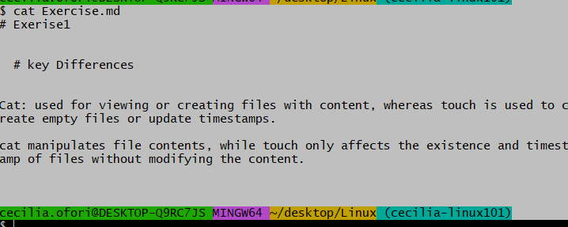
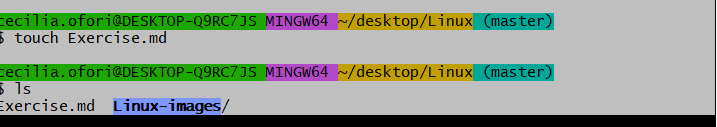
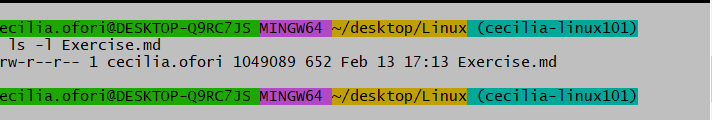

# Exerise1

               
  # key Differences

Cat: used for viewing or creating files with content, whereas touch is used to create empty files or update timestamps.

cat manipulates file contents, while touch only affects the existence and timestamp of files without modifying the content.

# cat

# Touch

# Exercise 2

File permissions define who can read, write, or execute a file. Permissions are typically shown as a combination of r, w, and x for the user, group, and others.

You can display the file permissions with:

#    permissions given to a file when it’s created:

By default, new files in Linux are typically created with permissions of 644 (rw-r--r--), meaning the owner can read/write, and others can read.

ls -l (filename)

# Default permission for folder when created

New directories are typically created with 755 (rwxr-xr-x), meaning the owner can read/write/execute, and others can read/execute

# Exercise 2c

mkdir (foldername)

# Exercise 3

Command to print the number of lines, words, and characters in a file: The wc command is used to count lines, words, and characters.

