# Exerise1

               
  # key Differences

Cat: used for viewing or creating files with content, whereas touch is used to create empty files or update timestamps.

cat manipulates file contents, while touch only affects the existence and timestamp of files without modifying the content.

# cat

# Touch

# Exercise 2

File permissions define who can read, write, or execute a file. Permissions are typically shown as a combination of r, w, and x for the user, group, and others.

You can display the file permissions with:

#    permissions given to a file when it’s created:

By default, new files in Linux are typically created with permissions of 644 (rw-r--r--), meaning the owner can read/write, and others can read.

ls -l (filename)

# Default permission for folder when created

New directories are typically created with 755 (rwxr-xr-x), meaning the owner can read/write/execute, and others can read/execute

# Exercise 2c

mkdir (foldername)

# Exercise 3

Command to print the number of lines, words, and characters in a file: The wc command is used to count lines, words, and characters.

# Exercise 3B

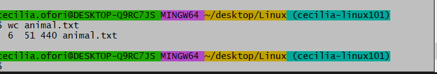

# Exercise 4
Get the first 3 lines in the animals.txt file:

Use the head command with -n to get the first 3 lines

# Exercise 4b
Count only the words within the first 3 lines:

Combine head and wc to count the words:

# Exercise 5

Command that starts with 'g' to search through files:

The command is grep.

# Exercise 5b
 # grep
 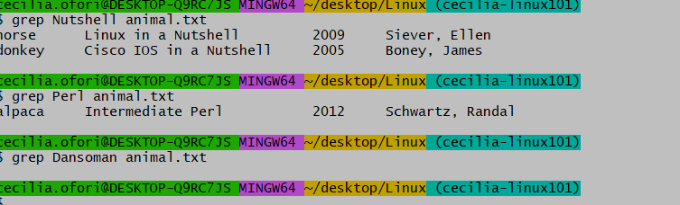

# Exercise 6
Command to list all files in a directory:

Use ls to list files:
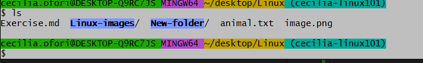

# Exercise 6b
A directory is a container used to organize files and other directories in the file system.

# Exercise 7

pwd stands for "Print Working Directory". It shows the current directory you're in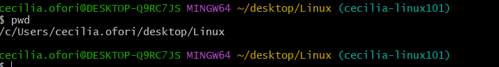

# Exercise 7b

echo: Displays a line of text or a variable's value
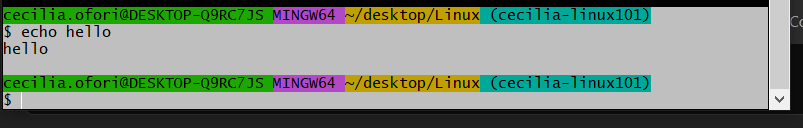

cd: Changes the current directory.
changed dirtectory from Linux to Asignment
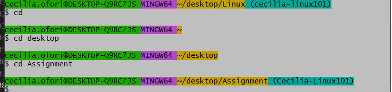

# Exercise 8
The dirs command shows the list of directories in the directory stack.
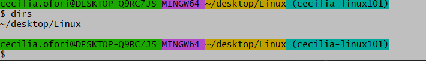

# Exercise 8b
Since I'm  using a Git Bash on a Windows machine, and it doesn't have the man command installed by default. 
so --help command is use to findmore details about mv

# Exercise 9
Date Command  print out the current day in the terminal:

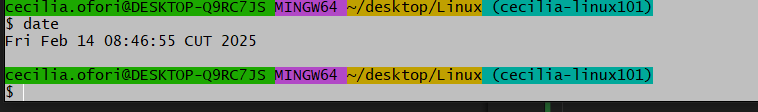

# Exercise 9b
awk: A powerful text-processing language used for pattern scanning and processing.
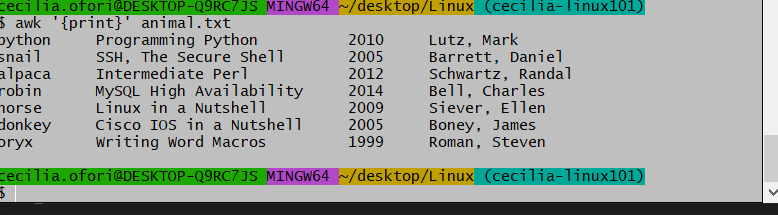

grep: Searches for patterns within a file
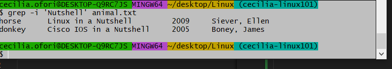

# Exercise 10
Environment variables store system-wide values and configurations. They are key-value pairs used by the system and applications.

   env variables 

1. PWD
2. HOMEPATH
3. OneDrive
4. HOMEDRIVE
5. NUMBER_OF_PROCESSORS
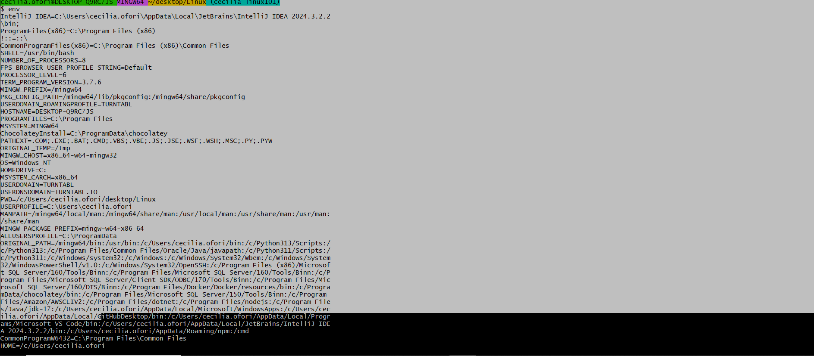

# Exercise 10b
more: Displays content one page at a time, but it doesn't allow scrolling backward.

but currently not available onGitbash on window by default

less: Similar to more, but it allows scrolling both forward and backward.

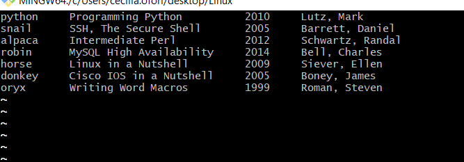

# Exercise 11
Command to see the type of a file in a directory:

Use the file command:
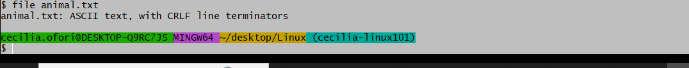

# Exercise 12
Unix file system tree:

The Unix file system tree is often called the Filesystem Hierarchy Standard (FHS).

3 important folders in this tree:

1. /home: User home directories.
2. /etc: Configuration files.
3. /bin: Essential system binaries.

# Exercise 13

head: Displays the first part of a file .(default is the first 10 lines)
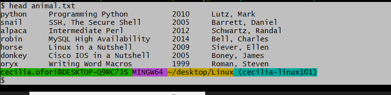

tail: Displays the last  part of a file. (default is the last 10 lines)
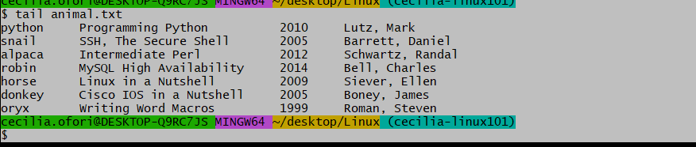

